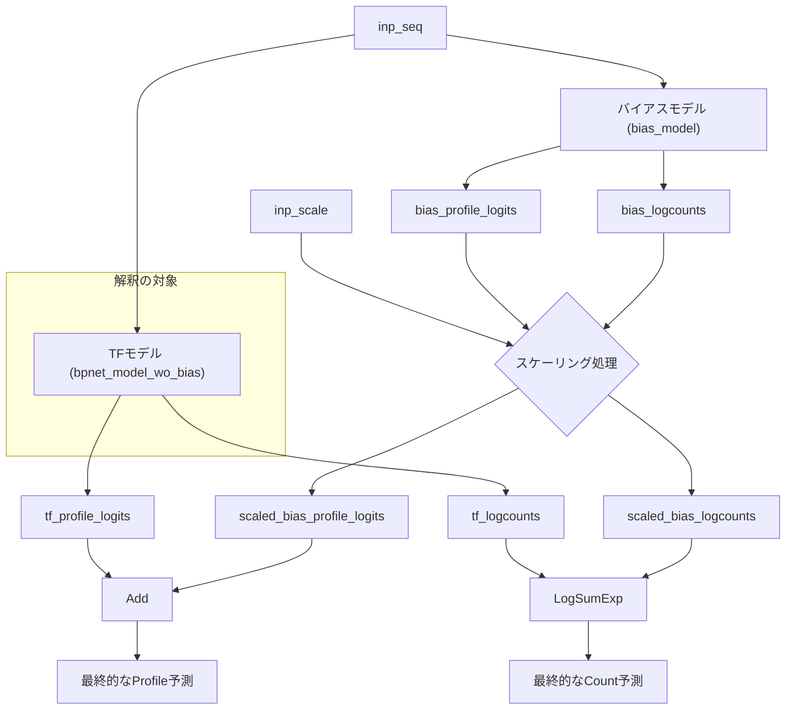

graph TD
    A[inp_seq] --> B[TFモデル (bpnet_model_wo_bias)];
    A --> C[バイアスモデル (bias_model)];
    D[inp_scale] --> E{スケーリング処理};

    B --> F[tf_profile_logits];
    B --> G[tf_logcounts];

    C --> H[bias_profile_logits];
    C --> I[bias_logcounts];

    H --> E;
    I --> E;

    E --> J[scaled_bias_profile_logits];
    E --> K[scaled_bias_logcounts];

    F --> L[Add];
    J --> L;

    G --> M[LogSumExp];
    K --> M;

    L --> N[最終的なProfile予測];
    M --> O[最終的なCount予測];

    subgraph 解釈の対象
        B
    end